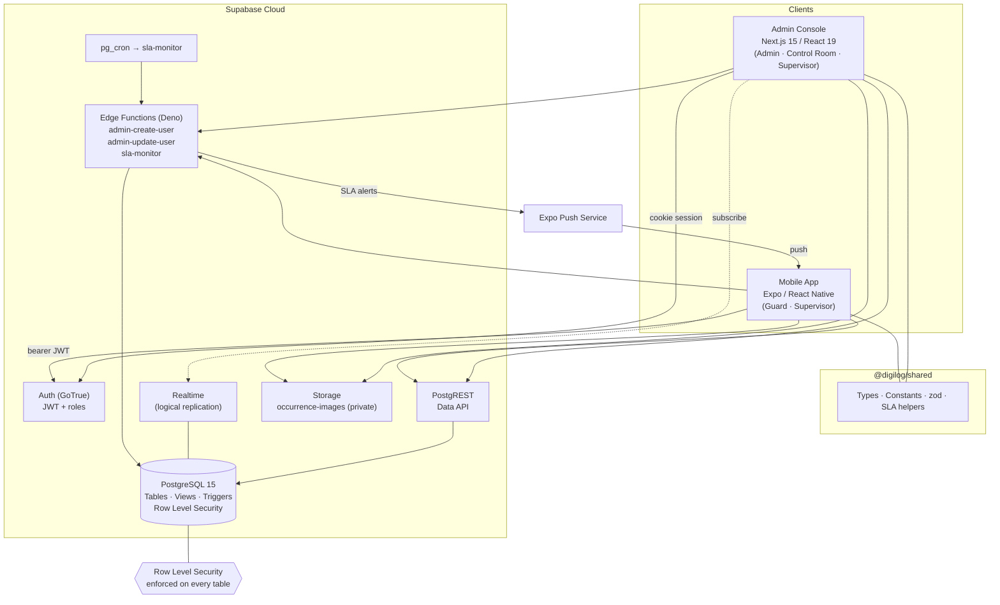
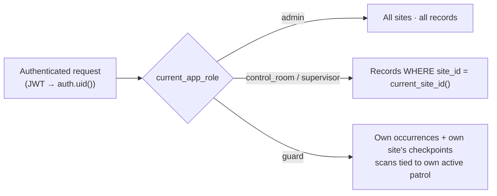
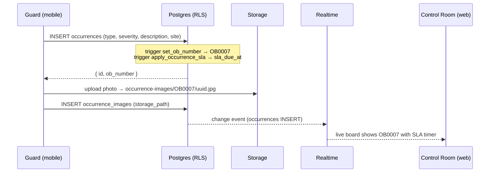
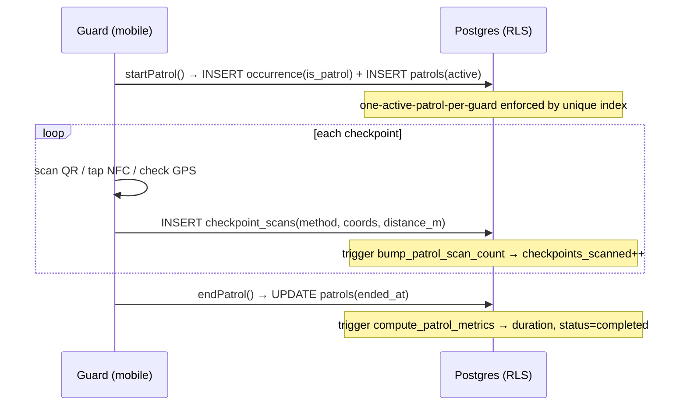

<div align="center">

# DigiLog 360

### Security Operations Platform — Infrastructure & Solution Architecture

**Proprietary & Confidential — © 2026 Kruz Naidoo. All Rights Reserved.**

</div>

> This document is the authoritative engineering reference for DigiLog 360: the
> problem it solves, its technology stack, system architecture, data model,
> business logic, access-control model, and operational runbook.
>
> The software is proprietary intellectual property of **Kruz Naidoo**. See
> [`LICENSE`](LICENSE). Unauthorized use, reproduction, or distribution is prohibited.

---

## Table of Contents

1. [Overview](#1-overview)
2. [Technology Stack](#2-technology-stack)
3. [System Architecture](#3-system-architecture)
4. [Monorepo Layout](#4-monorepo-layout)
5. [Database Schema (ERD)](#5-database-schema-erd)
6. [Enumerations](#6-enumerations)
7. [Business Logic — Triggers & Functions](#7-business-logic--triggers--functions)
8. [SLA Engine](#8-sla-engine)
9. [Access Control (RLS / UAC)](#9-access-control-rls--uac)
10. [Realtime, Storage & Edge Functions](#10-realtime-storage--edge-functions)
11. [Key Workflows (Sequence Diagrams)](#11-key-workflows-sequence-diagrams)
12. [Application Surfaces](#12-application-surfaces)
13. [Checkpoint Scanning (QR / NFC / GPS)](#13-checkpoint-scanning-qr--nfc--gps)
14. [Security Posture](#14-security-posture)
15. [Deployment & Operations Runbook](#15-deployment--operations-runbook)
16. [Accounts](#16-accounts)
17. [License](#17-license)

---

## 1. Overview

DigiLog 360 is a ground-up rebuild of the legacy ASP.NET MVC *OccurrenceBook*
application into a modern, real-time, role-based security operations platform.

It digitises the security "Occurrence Book" — the logbook guards and control rooms
use to record incidents — and adds **live SLA tracking**, **rich reporting**, and a
brand-new **mobile patrol + checkpoint-scanning** capability that the legacy system
lacked (its "patrol" was only a start/stop timer).

| Surface | Audience | Purpose |
| --- | --- | --- |
| **Admin Console** (web) | Admin, Control Room, Supervisor | Command center: dashboards, live SLA board, reporting, user/site/checkpoint administration, patrol oversight |
| **Mobile App** | Guard, Supervisor | Field operations: log occurrences with photos, run patrols, scan checkpoints (QR/NFC/GPS) |
| **Backend** | — | Postgres data model, auth, row-level security, realtime, storage, scheduled jobs |

**Core domain entities:** Sites · Profiles (users) · Occurrences (incidents, "OB"
numbered) · Occurrence Updates · Occurrence Reports · Occurrence Images · Patrol
Routes · Checkpoints · Patrols · Checkpoint Scans.

---

## 2. Technology Stack

### Admin Console (`apps/admin`)
| Concern | Technology |
| --- | --- |
| Framework | Next.js 15 (App Router, React Server Components) |
| UI runtime | React 19 |
| Language | TypeScript 5.6 (strict) |
| Styling | Tailwind CSS 3.4 + CSS variables (light/dark) |
| Auth/session (SSR) | `@supabase/ssr` 0.10 (cookie-based) |
| Data client | `@supabase/supabase-js` 2 |
| Charts | Recharts |
| Icons | lucide-react |
| QR generation | qrcode.react |
| Utilities | date-fns, clsx, tailwind-merge, class-variance-authority |

### Mobile App (`apps/mobile`)
| Concern | Technology |
| --- | --- |
| Framework | Expo SDK 52 (managed) + React Native 0.76 |
| Navigation | expo-router 4 (file-based) |
| Language | TypeScript 5.6 (strict) |
| Auth/session | `@supabase/supabase-js` + AsyncStorage persistence |
| Camera / QR | expo-camera |
| Location / geofence | expo-location |
| NFC | react-native-nfc-manager (dev build) |
| Push | expo-notifications |
| Secure storage | expo-secure-store |

### Backend (`supabase/`)
| Concern | Technology |
| --- | --- |
| Database | PostgreSQL 15 (Supabase) |
| Auth | Supabase Auth (GoTrue), JWT |
| Data API | PostgREST (auto REST over Postgres) |
| Realtime | Supabase Realtime (logical replication) |
| Object storage | Supabase Storage (S3-backed) |
| Serverless | Supabase Edge Functions (Deno) |
| Scheduling | pg_cron + pg_net |

### Shared & Tooling
| Concern | Technology |
| --- | --- |
| Shared code | `@digilog/shared` — TS types, constants, zod schemas, SLA helpers |
| Monorepo | npm workspaces |
| Validation | zod |
| Runtime | Node.js ≥ 20 |

---

## 3. System Architecture



**Principle:** the database is the single source of truth and the security
boundary. Every table has Row Level Security; clients talk directly to PostgREST
with the user's JWT, and Postgres decides what each role may read or write.
Privileged operations (creating users) run in Edge Functions with the service role.

---

## 4. Monorepo Layout

```
NewDigiLog/
├── apps/
│   ├── admin/                 # Next.js admin console (web)
│   │   ├── src/app/           # App Router routes
│   │   │   ├── (app)/         # authenticated shell + pages
│   │   │   ├── login/         # auth
│   │   │   └── print/         # printable report (PDF via browser)
│   │   ├── src/components/    # UI kit + feature components
│   │   ├── src/lib/           # supabase clients, auth guard, utils
│   │   └── src/middleware.ts  # session refresh + route protection
│   └── mobile/                # Expo guard app
│       ├── app/               # expo-router screens (tabs, scan, detail)
│       └── src/lib/           # supabase, auth context, patrol/scan helpers
├── packages/
│   └── shared/                # @digilog/shared — cross-platform TS
├── supabase/
│   ├── migrations/            # ordered SQL (schema → triggers → RLS → storage → views)
│   ├── functions/             # edge functions (Deno)
│   ├── seed.sql               # sites + sample checkpoints/route
│   ├── _deploy_all.sql        # all migrations + seed, pre-assembled
│   └── schedule_sla_monitor.sql
├── scripts/
│   └── seed-accounts.mjs      # provisions login accounts (service role)
├── LICENSE                    # proprietary license — Kruz Naidoo
└── README.md                  # this document
```

> `apps/mobile` is intentionally **outside** npm workspaces to avoid React
> dual-version conflicts between Next.js and Expo; it consumes `@digilog/shared`
> via metro `watchFolders` + babel module-resolver aliases.

---

## 5. Database Schema (ERD)

```mermaid
erDiagram
  AUTH_USERS ||--|| PROFILES : "1:1 (trigger)"
  SITES ||--o{ PROFILES : "assigns"
  SITES ||--o{ OCCURRENCES : "scopes"
  SITES ||--o{ PATROL_ROUTES : "owns"
  SITES ||--o{ CHECKPOINTS : "owns"
  SITES ||--o{ PATROLS : "scopes"
  PROFILES ||--o{ OCCURRENCES : "logs"
  OCCURRENCES ||--o{ OCCURRENCE_UPDATES : "has"
  OCCURRENCES ||--|| OCCURRENCE_REPORTS : "has (1:1)"
  OCCURRENCES ||--o{ OCCURRENCE_IMAGES : "has"
  OCCURRENCES |o--|| PATROLS : "patrol occurrence"
  PATROL_ROUTES ||--o{ ROUTE_CHECKPOINTS : "includes"
  CHECKPOINTS ||--o{ ROUTE_CHECKPOINTS : "in"
  PATROL_ROUTES ||--o{ PATROLS : "guides"
  PROFILES ||--o{ PATROLS : "performs"
  PATROLS ||--o{ CHECKPOINT_SCANS : "records"
  CHECKPOINTS ||--o{ CHECKPOINT_SCANS : "scanned at"

  SITES {
    uuid id PK
    text name UK
    text code UK
    text address
    text timezone
    bool is_active
  }
  PROFILES {
    uuid id PK_FK "→ auth.users"
    text email
    text full_name
    app_role role
    uuid site_id FK
    bool is_active
    text expo_push_token
  }
  OCCURRENCES {
    bigint id PK
    text ob_number UK "OB0001…"
    text occurrence_type
    severity_level severity
    text description
    timestamptz incident_at
    uuid site_id FK
    uuid logged_by FK
    occurrence_status status
    bool is_patrol
    int sla_hours
    timestamptz sla_due_at
    timestamptz last_sla_update_at
    timestamptz closed_at
  }
  OCCURRENCE_UPDATES {
    bigint id PK
    bigint occurrence_id FK
    text notes
    occurrence_status status
    uuid updated_by FK
    timestamptz created_at
  }
  OCCURRENCE_REPORTS {
    bigint id PK
    bigint occurrence_id FK_UK
    text description
    text personnel
    text responding_officer
    text emergency_services
    text cctv
    text property_damage
    text immediate_actions
    text next_steps
    occurrence_status status
  }
  OCCURRENCE_IMAGES {
    bigint id PK
    bigint occurrence_id FK
    text storage_path
    uuid captured_by FK
    timestamptz captured_at
  }
  PATROL_ROUTES {
    uuid id PK
    uuid site_id FK
    text name
    int expected_duration_minutes
    bool is_active
  }
  CHECKPOINTS {
    uuid id PK
    uuid site_id FK
    text name
    text code
    text qr_token UK
    text nfc_tag_id UK
    float latitude
    float longitude
    int geofence_radius_m
    int sort_order
  }
  ROUTE_CHECKPOINTS {
    uuid id PK
    uuid route_id FK
    uuid checkpoint_id FK
    int sort_order
  }
  PATROLS {
    bigint id PK
    uuid guard_id FK
    uuid site_id FK
    uuid route_id FK
    bigint occurrence_id FK
    patrol_status status
    timestamptz started_at
    timestamptz ended_at
    numeric duration_minutes
    int checkpoints_total
    int checkpoints_scanned
  }
  CHECKPOINT_SCANS {
    bigint id PK
    bigint patrol_id FK
    uuid checkpoint_id FK
    uuid guard_id FK
    scan_method method
    timestamptz scanned_at
    float latitude
    float longitude
    float distance_m
    bool is_verified
  }
```

**Views** (security-invoker, so RLS of the caller still applies):
- `occurrences_live` — open occurrences enriched with computed `is_sla_breached`,
  `is_sla_update_due`, `minutes_remaining`, `has_report`.
- `patrols_detailed` — patrols joined with route name, site name, and scan count.

---

## 6. Enumerations

| Enum | Values |
| --- | --- |
| `app_role` | `admin`, `control_room`, `supervisor`, `guard` |
| `severity_level` | `critical`, `high`, `medium`, `low` |
| `occurrence_status` | `open`, `acknowledged`, `in_progress`, `on_patrol`, `resolved`, `closed` |
| `patrol_status` | `active`, `completed`, `abandoned` |
| `scan_method` | `qr`, `nfc`, `gps`, `manual` |

---

## 7. Business Logic — Triggers & Functions

All domain invariants are enforced **in the database**, so they hold regardless
of which client writes the data.

| Object | Type | Behaviour |
| --- | --- | --- |
| `set_ob_number()` | BEFORE INSERT on `occurrences` | Assigns the next `OB0001`-style number from `ob_number_seq` |
| `apply_occurrence_sla()` | BEFORE INSERT/UPDATE on `occurrences` | Computes `sla_hours`/`sla_due_at` from severity; stamps `last_sla_update_at`; sets `closed_at` on terminal status; recomputes deadline if severity changes |
| `compute_patrol_metrics()` | BEFORE UPDATE on `patrols` | On `ended_at`, computes `duration_minutes` and flips `active → completed` |
| `bump_patrol_scan_count()` | AFTER INSERT on `checkpoint_scans` | Increments `patrols.checkpoints_scanned` |
| `handle_new_user()` | AFTER INSERT on `auth.users` | Creates the matching `profiles` row from signup metadata (role/site/name) |
| `prevent_profile_privilege_escalation()` | BEFORE UPDATE on `profiles` | Blocks non-admins from changing their own `role` or `site_id` |
| `set_updated_at()` | BEFORE UPDATE | Maintains `updated_at` on all mutable tables |
| `haversine_m()` | function | Great-circle distance (m) for GPS checkpoint verification |
| `current_app_role()`, `current_site_id()`, `is_admin()`, `has_any_role()`, `can_access_site()` | SECURITY DEFINER | RLS helper functions (bypass RLS to avoid recursion) |

---

## 8. SLA Engine

SLAs are derived from incident severity, enforced by the database, and surfaced
live in the admin console and via push notifications.

| Severity | Resolve within | Update cadence |
| --- | --- | --- |
| **Critical** | 1 hour | every 30 min |
| **High** | 4 hours | every 60 min |
| **Medium** | 24 hours | every 6 hours |
| **Low** | 7 days (168h) | every 24 hours |

- On insert, `sla_due_at = now() + sla_hours`.
- An occurrence is **breached** when `now() > sla_due_at` and not terminal.
- An **update is due** when `now() ≥ last_sla_update_at + update_interval`.
- Posting an update or report stamps `last_sla_update_at`, resetting the cadence.
- The `occurrences_live` view computes these flags server-side; the live board
  refreshes them on realtime events and on a 60-second timer; `sla-monitor`
  pushes alerts for breaches/overdue updates.

The same thresholds are mirrored client-side in `@digilog/shared` (`SLA_CONFIG`,
`sla.ts`) for instant UI feedback.

---

## 9. Access Control (RLS / UAC)

Row Level Security is enabled on **every** table. Policies use SECURITY DEFINER
helper functions that read the caller's profile without recursing through RLS.



| Table | admin | control_room / supervisor | guard |
| --- | --- | --- | --- |
| `sites` | full | read | read |
| `profiles` | full | read same-site | read/update **self** |
| `occurrences` | full | CRUD same-site | create own · read own/site |
| `occurrence_updates` | full | create (same-site parent) | read visible |
| `occurrence_reports` | full | create/update | read visible |
| `occurrence_images` | full | read · delete | insert own · read visible |
| `patrol_routes` / `checkpoints` | full | manage same-site | read same-site |
| `patrols` | full | read/end same-site | create/run own |
| `checkpoint_scans` | full | read same-site | insert for **own active patrol** |

Additional guarantees:
- A trigger prevents non-admins from escalating `role` or moving `site_id`.
- A partial unique index enforces **one active patrol per guard**.
- `checkpoint_scans` are insert-only for guards (immutable proof-of-presence).
- The **service-role** key (Edge Functions, account seeding) bypasses RLS by design.
- Surface separation: the web console rejects guard-only roles; the mobile app
  rejects web-only roles.

---

## 10. Realtime, Storage & Edge Functions

**Realtime** (replaces the legacy SignalR hub): the tables `occurrences`,
`occurrence_updates`, `occurrence_reports`, `patrols`, and `checkpoint_scans` are
published to `supabase_realtime`. The admin **Live Occurrences** board subscribes
to `occurrences` changes and re-renders instantly when guards log incidents.

**Storage** (replaces Azure Blob): a **private** bucket `occurrence-images`
(5 MB limit, JPEG/PNG/WebP) holds photo evidence. Path convention
`occurrence-images/<OB_NUMBER>/<uuid>.jpg`. Clients read via short-lived
**signed URLs**; storage policies restrict writes to the authenticated owner.

**Edge Functions** (Deno):

| Function | Auth | Purpose |
| --- | --- | --- |
| `admin-create-user` | Admin JWT | Creates an auth user + profile (role/site/name) |
| `admin-update-user` | Admin JWT | Updates role/site/name, resets password, activates/deactivates (ban) |
| `sla-monitor` | service / cron | Scans `occurrences_live`, pushes SLA alerts to affected sites' control room via Expo |

---

## 11. Key Workflows (Sequence Diagrams)

### 11.1 Guard logs an occurrence (mobile)



### 11.2 Patrol with checkpoint scan



### 11.3 Authentication & profile provisioning

```mermaid
sequenceDiagram
  participant C as Client
  participant AUTH as Supabase Auth
  participant DB as Postgres

  C->>AUTH: signInWithPassword(email, pw)
  AUTH-->>C: JWT (sub = auth.uid())
  C->>DB: SELECT profiles WHERE id = auth.uid()
  DB-->>C: { role, site_id, is_active }
  Note over C: web allows admin/control/supervisor;<br/>mobile allows guard/supervisor
```

---

## 12. Application Surfaces

### Admin Console — feature map
- **Dashboard** — KPIs, 6-month trend, type/severity breakdown, top sites, SLA alerts.
- **Live Occurrences** — realtime SLA board (breached → due → on-track), inline updates.
- **All Occurrences** — filterable/searchable master table.
- **History** — resolved occurrences + completed patrols.
- **Log Incident** — create occurrence (site-scoped to the operator).
- **Reports** — create detailed report; print-to-PDF view.
- **Occurrence detail** — info, update timeline, report, photo gallery (signed URLs).
- **Patrols** — active patrol monitor + checkpoint progress + end-patrol.
- **Checkpoints** — CRUD + printable QR labels, NFC tag IDs, GPS/geofence.
- **Team Status** — field staff availability + on-patrol state.
- **Users** *(admin)* — create/edit, roles, site assignment, password reset, activate/deactivate.
- **Sites** *(admin)* — site CRUD.

### Mobile App — feature map
- Sign in (guard/supervisor), persistent session.
- Home dashboard (my open, logged-today, active-patrol shortcut).
- Log occurrence with multi-photo capture → Storage.
- My logs + occurrence detail.
- Patrol: start (optional route), scan checkpoints, live progress, end.
- Push registration (stores Expo token on profile for SLA alerts).

---

## 13. Checkpoint Scanning (QR / NFC / GPS)

A genuinely new capability versus the legacy timer-only "patrol". Each checkpoint
supports three independent verification methods:

| Method | How it works | Data captured |
| --- | --- | --- |
| **QR** | Camera scans a label encoding `DIGILOG-CP:<qr_token>`; matched against `checkpoints.qr_token` | `method=qr`, verified |
| **NFC** | Phone taps a tag; UID matched against `checkpoints.nfc_tag_id` (requires dev build) | `method=nfc`, verified |
| **GPS** | Device location compared to checkpoint lat/long via haversine vs `geofence_radius_m` | `method=gps`, `distance_m`, `is_verified` = within radius |

Each scan inserts an immutable `checkpoint_scans` row tied to the guard's active
patrol, and the `bump_patrol_scan_count` trigger advances patrol progress.

---

## 14. Security Posture

- **Defense at the data layer** — RLS on every table; the API cannot leak rows a
  role shouldn't see, regardless of client bugs.
- **Privilege-escalation guard** — DB trigger blocks self role/site changes.
- **Least privilege** — anon/service keys never embedded in clients; only the
  anon key ships to apps; service role lives server-side (Edge Functions, scripts).
- **Private storage** — evidence photos are non-public; access via signed URLs only.
- **HTTP hardening** — admin sets `X-Frame-Options`, `X-Content-Type-Options`,
  `Referrer-Policy`, `Permissions-Policy`; `X-Powered-By` disabled.
- **Fail-fast config** — both apps throw clear errors if Supabase env is missing.
- **Auditability** — updates and scans are append-only; OB numbers are immutable.
- **Secrets** — all `.env*` files are git-ignored; rotate keys before production.

---

## 15. Deployment & Operations Runbook

### Prerequisites
- Node.js ≥ 20, npm ≥ 10
- A Supabase project + (optionally) the Supabase CLI
- Mobile: Expo Go (QR/GPS) or an EAS dev build (NFC)

### Install
```bash
npm install                      # root + admin + shared
cd apps/mobile && npm install    # mobile (separate from workspaces)
```

### Deploy the backend
**Option A — Supabase CLI** (needs the DB password when linking):
```bash
supabase link --project-ref <YOUR_PROJECT_REF>
supabase db push
supabase db execute --file supabase/seed.sql
supabase functions deploy admin-create-user admin-update-user sla-monitor
```
**Option B — no CLI:** run `supabase/_deploy_all.sql` (all migrations + seed,
pre-assembled) in the Supabase SQL editor. Edge functions still require the CLI;
only the in-app "Add User" form depends on them.

### Seed login accounts
```bash
node --env-file=.env scripts/seed-accounts.mjs
```

### Schedule the SLA watchdog (optional)
Fill in `supabase/schedule_sla_monitor.sql` and run it (uses `pg_cron` + `pg_net`,
every 5 min).

### Run the apps
```bash
# Admin (http://localhost:3000) — needs apps/admin/.env.local
npm run admin

# Mobile — needs apps/mobile/.env
cd apps/mobile && npm start
```

### Environment variables
| File | Keys |
| --- | --- |
| `apps/admin/.env.local` | `NEXT_PUBLIC_SUPABASE_URL`, `NEXT_PUBLIC_SUPABASE_ANON_KEY` |
| `apps/mobile/.env` | `EXPO_PUBLIC_SUPABASE_URL`, `EXPO_PUBLIC_SUPABASE_ANON_KEY` |
| `.env` (root) | `SUPABASE_URL`, `SUPABASE_ANON_KEY`, `SUPABASE_SERVICE_ROLE_KEY` |

### Regenerate DB types after schema changes
```bash
npm run db:types   # supabase gen types → packages/shared/src/database.types.ts
```

---

## 16. Accounts

Seeded by `scripts/seed-accounts.mjs` (change passwords before production):

| Role | Email | Password | Site | Surface |
| --- | --- | --- | --- | --- |
| admin | `admin@digilog360.com` | `Admin123!` | HQ Central | web |
| control_room | `control@digilog360.com` | `Control123!` | HQ Central | web |
| supervisor | `supervisor@digilog360.com` | `Supervisor123!` | HQ Central | web + mobile |
| guard | `guard@digilog360.com` | `Guard123!` | HQ Central | mobile |
| control_room | `sandton.control@digilog360.com` | `Control123!` | Sandton | web |
| guard | `sandton.guard@digilog360.com` | `Guard123!` | Sandton | mobile |

The Sandton accounts exist to validate site-level RLS isolation.

---

## 17. License

**Proprietary — © 2026 Kruz Naidoo. All Rights Reserved.**

This software and all associated materials are the exclusive intellectual
property of Kruz Naidoo. No use, reproduction, modification, or distribution is
permitted without express prior written authorization. See [`LICENSE`](LICENSE)
for the full terms.
# Digital-Application

